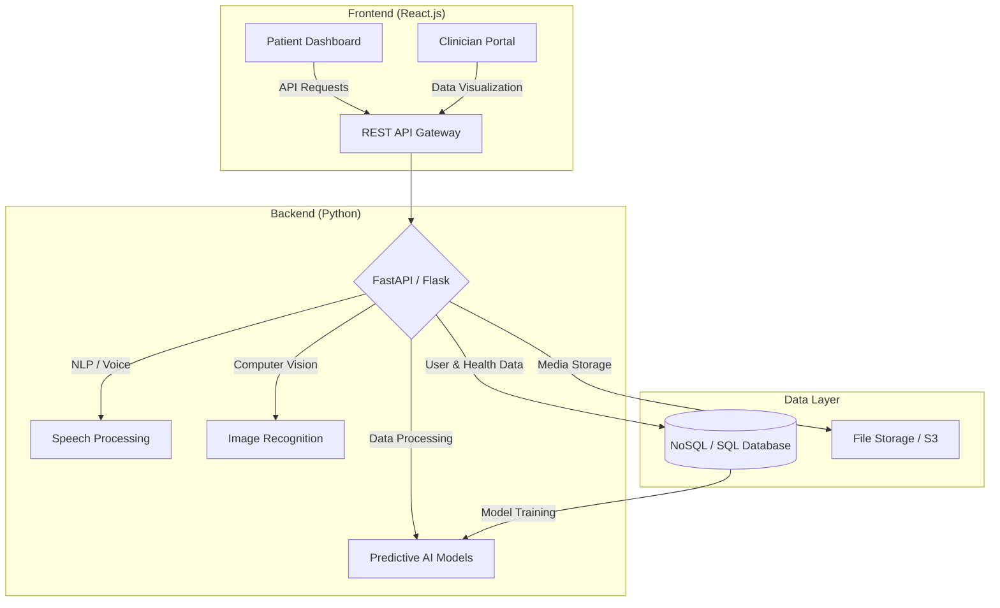

# Dia-Pilot 🚑🤖
### Proactive AI-Powered Diabetes Management Platform

Dia-Pilot is a proactive, AI-driven diabetes management ecosystem built to shift healthcare from reactive monitoring to predictive guidance. The backend is a high-performance **Python** implementation hosted on **Microsoft Azure**, ensuring scalability, security, and clinical reliability.

---

## 🏗️ System Architecture

Our cloud-native architecture leverages Python-based Azure Functions to orchestrate AI services and patient data in real-time.

---

## 💡 The Problem & Solution
* **The Problem:** Diabetes care is currently reactive and fragmented. Patients experience "alert fatigue" from reactive alarms, and manual logging leads to burnout.
* **The Solution:** Dia-Pilot predicts glucose risks before they occur, automates data collection via AI Vision and Speech, and delivers decision-ready insights to clinicians.

---

## ✨ Key Features
* **🔮 Predictive Intelligence:** Glycemic forecasting and early hypoglycemia detection.
* **⚡ Frictionless Input:** Food photo logging and voice-based health updates.
* **🏥 Clinician Enablement:** One-page executive health summaries and risk-based triaging.
* **🧭 Behavioral Intelligence:** Context-aware nudges and metabolic peer matching.

---

## 👩‍💻 Team
* **[Nitya Gosain](https://github.com/Nitya-003)** — Full Stack Web Developer (MERN, Blockchain)
* **[Saksham Goel](https://github.com/Saksham-official)** — AI/ML Engineer & Python Web Developer
* **[Arshiya Kapoor](https://github.com/arshiya999)** — AI/ML Engineer & Python Web Developer

---

## 📜 License
This project is licensed under the **Apache 2.0 License** — suitable for open innovation and public health deployment.

---

## _Built with ❤️ to redefine diabetes care._
