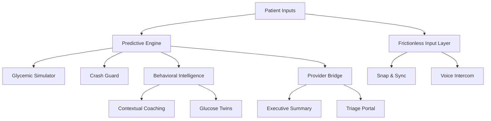

# 🩺 Dia-Pilot
**Proactive AI Ecosystem for Diabetes Management**

> Transitioning diabetes care from manual tracking to predictive, automated guidance.

---

## Problem Statement
Diabetes management today is largely reactive:
- Manual glucose tracking is time-consuming and error-prone
- Patients receive alerts after glucose events occur
- Clinicians face data overload with limited actionable insight

This results in preventable hypoglycemic events, burnout, and long-term complications.

---

## Solution Overview
**Dia-Pilot** is a proactive AI-driven ecosystem designed to predict, prevent, and guide diabetes management before emergencies occur.

The platform emphasizes:
- Prevention over correction  
- Zero-effort patient interaction  
- Clinically actionable summaries for healthcare providers  

---

## Key Features

### 1. Predictive Engine (The Forecast)
- **Glycemic Simulator**  
  What-if simulation to predict glucose response before meals or exercise.
- **Crash Guard**  
  Early hypoglycemia alerts (~20 minutes ahead) using multi-sensor fusion  
  *(CGM + heart rate + skin temperature)*.

---

### 2. Frictionless Input (Zero-Effort Logging)
- **Snap & Sync**  
  AI vision-based meal logging from a single photo.
- **Voice Intercom**  
  Natural language, hands-free logging.

---

### 3. Behavioral Intelligence (The Nudge)
- **Contextual Coaching**  
  Personalized nudges based on historical glucose behavior.
- **Glucose Twins**  
  Peer-to-peer strategy sharing with metabolically similar users.

---

### 4. Provider Bridge (Clinical ROI)
- **Executive Summary**  
  One-page clinical report condensing weeks of patient data.
- **Triage Portal**  
  Early risk detection and patient prioritization for medical teams.

---

## Conceptual Architecture

---

## ⚖️ License
Licensed under the Apache License 2.0.

This project is open-source to encourage ethical, scalable adoption in public healthcare systems.

